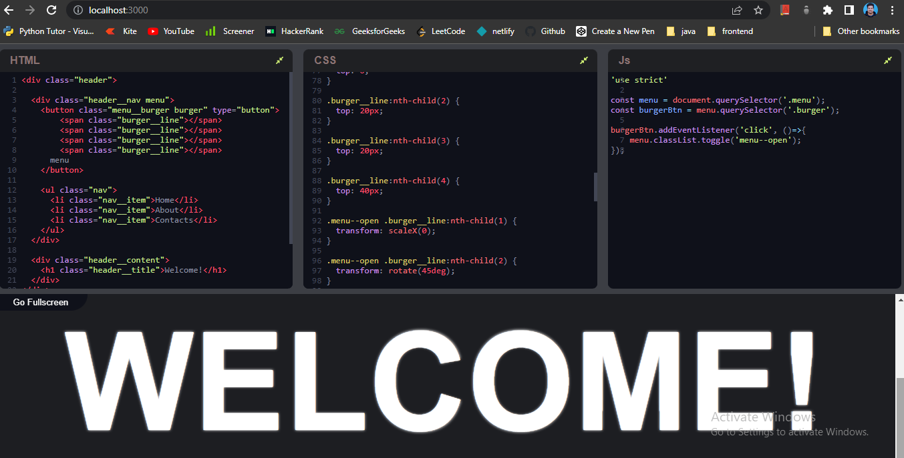

  

# Codepen Clone

A Codepen clone, built with React and CodeMirror.

# Features

- Toggleable fullscreen mode
- Auto render code (within 250ms)
- Auto-close tags (For HTML and XML)
- Auto-close brackets (For JavaScript and CSS)
- Highlight unclosed brackets (For JavaScript)
- Highlight active brackets (Brackets near cursor)
- Linting
- Expand-collapse code editors
- Material theme
- Mobile responsive

Supports screen size of a generic tablet. Below that, the text would become illegible. So, an error image is displayed for screens 400px and below.

# Built With

- React
- CodeMirror
- Codemirror2
- iframe

- ### Npm Packages Used
  - Fort Awesome(for icon)
  - fullscreen-react
